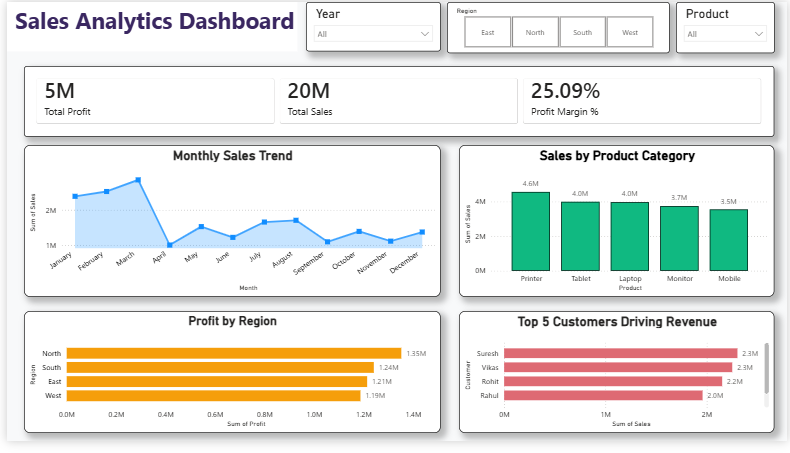

# 📈 Sales Data ETL Pipeline & Business Intelligence Dashboard

## 📌 Project Overview

This project demonstrates an **end-to-end data analytics workflow** by transforming raw sales data into meaningful business insights using **Excel, Python, SQL, and Power BI**.

The project follows a real-world analytics pipeline:

**Raw Excel Data → Python Data Cleaning → SQL Database → Power BI Dashboard → Business Insights**

The objective of this project was to clean and transform raw sales data, perform business analysis using SQL, and build an interactive Power BI dashboard to track sales performance, profitability, product trends, regional performance, and customer contribution.

---

# 🎯 Business Problem

Businesses generate large volumes of sales data but require structured analysis to understand:

- Overall sales performance
- Profitability trends
- Best-performing products
- Regional performance
- Customer contribution
- Monthly sales patterns

This project solves these problems by converting raw transactional data into actionable insights through data analytics and visualization.

---

# 🛠️ Tools & Technologies Used

| Tool | Purpose |
|---|---|
| Excel | Raw data source |
| Python (Pandas) | Data cleaning and preprocessing |
| PostgreSQL | Data storage and SQL analysis |
| Power BI | Interactive dashboard development |
| GitHub | Project documentation and version control |

---

# 🔄 Project Workflow

## 1. Raw Data Collection

The project started with a raw sales dataset containing information about orders, customers, products, regions, sales, costs, and profits.

Dataset Columns:

- Order_ID
- Order_Date
- Customer
- Region
- Product
- Sales
- Cost
- Profit
- Year
- Month

---

## 2. Data Cleaning Using Python

Python and Pandas were used to prepare the raw dataset for analysis.

Data preparation steps included:

- Loading raw Excel data
- Understanding dataset structure
- Checking data quality
- Cleaning and transforming data
- Preparing analysis-ready data

---

## 3. SQL Database & Business Analysis

The cleaned dataset was loaded into PostgreSQL for structured analysis.

SQL queries were created to analyze:

- Total sales and profit performance
- Regional profitability
- Product-level performance
- Monthly sales trends
- Customer revenue contribution
- Profit margin analysis

---

# 📊 Power BI Dashboard

An interactive Power BI dashboard was developed to monitor key business metrics and identify important sales patterns.

## Key Performance Indicators (KPIs)

### 💰 Total Sales
Tracks overall revenue generated from sales.

### 📈 Total Profit
Measures overall business profitability.

### 📊 Profit Margin %
Shows profitability efficiency by comparing profit against sales.

---

# 📌 Dashboard Features

## 📈 Monthly Sales Trend

Analyzes sales performance across different months to identify trends and patterns.

## 📦 Sales by Product Category

Highlights products contributing the highest sales revenue.

## 🌎 Profit by Region

Compares profit performance across different geographical regions.

## 👥 Top 5 Customers Driving Revenue

Identifies customers contributing the highest sales value.

## 🎛️ Interactive Filters

Dashboard includes slicers for:

- Year
- Month
- Product

---

# 📸 Dashboard Preview



---

# 💡 Key Business Insights

This dashboard helps answer important business questions:

✔ Which products generate the highest sales?  
✔ Which regions contribute the most profit?  
✔ How does sales performance change over time?  
✔ Which customers drive the most revenue?  
✔ How efficiently are sales converting into profit?

---

# 📂 Project Structure

```
Sales Data ETL Pipeline & Business Intelligence Dashboard

│
├── 01_Raw_Data
│
├── 02_Python_Data_Cleaning
│       └── Sales_Data_Cleaning.ipynb
│
├── 03_SQL_Database
│       └── Sales_Analysis_Queries.sql
│
├── 04_PowerBI_Dashboard
│       └── Sales_ETL_BI_Dashboard.pbix
│
├── 05_Project_Screenshots
│       └── Dashboard_Preview.png
│
└── README.md
```

---

# 🚀 Project Outcome

Through this project, I developed practical experience in:

- Data cleaning and transformation using Python
- Building ETL workflows
- SQL-based business analysis
- Creating interactive BI dashboards
- Converting raw data into actionable insights

This project represents a complete analytics workflow followed by modern Data Analysts to support data-driven decision-making.

---

## 👤 Author

**Sachi Godbole**

GitHub: [Sachi-Godbole](https://github.com/Sachi-Godbole)
